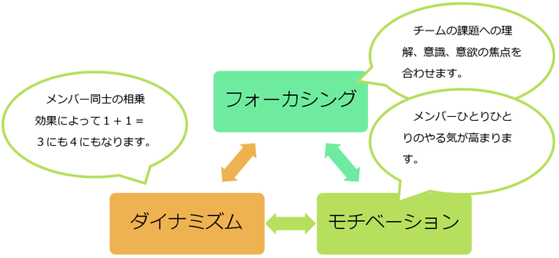
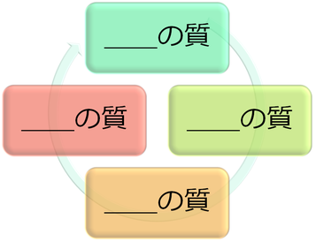

# チーム

## チームビルディング
なぜ、チームビルディングでは、人間関係にフォーカスするのか。より良いチームとは何か。より良いチームを作るにはどうしたら良いか。

このセッションは「チームビルディング」がテーマです。どうすればこのプロジェクトが成功するのか、みなさんと一緒に考えたいと思います。

そしてもう一つ。アジャイル開発です。どうすればプロジェクトは好循環で回るようになるのか。そのシンプルな答えがアジャイル開発にあると思っています。アジャイル開発は次のセッションのテーマです。

このLED-Campでチームビルディングの概念を理解し、アジャイル開発を実践してください。生きた知識と経験を獲得してください。そして、実際の現場で活用してください。

みなさんのこれからの技術者人生が、楽しく、やりがいのあるものになりますように。

> どうしたら、チームになれるのでしょうか。  
> 次で考えてみましょう。

## チームビルディングとは、
「個の集まり」から「機能するチーム」にすることです。

> チームビルディングをまったくやらないとどうなるか。
> 開発現場で起きそうな失敗パターンを上手く説明した「モデル」があります。
> 次で見てみましょう。

ダニエル・キムの組織成功の循環モデル

**「関係の質」に着目した場合**

「関係の質」が向上すると、「思考の質」が向上し、「行動の質」が向上し、結果として「結果の質」が向上します。矢印の流れで循環します。

**「結果の質」に着目した場合**

最初に「結果の質」に着目すると、逆回転します。

先ず、直接的に結果になる行動以外を排除するでしょう。次に柔軟な思考ができなくなります。結果として、「関係の質」が低下します。

> 次は、理解度チェックです。  
> このページでの理解度を確認しましょう。

## 理解度チェック

**項目1：＿＿に適切な文字を入れ、「ダニエル・キムの組織成功の循環モデル」を完成させましょう**

**項目2：「ダニエル・キムの組織成功の循環モデル」で最初に着目すべき質はどれでしょうか？**

> チームビルディングの一環として、チームで決めて欲しいことがあります。  
> ミッションとルールです。次章でお話します。