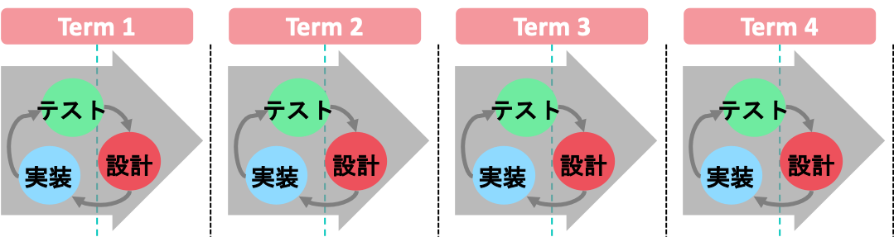

# はじめに

本章では、Scrumフレームワークについて、基本的な知識をまとめております。  
「みんなでScrum!」では演習により理解を深めていただきますので、事前にご一読ください。なお、本資料はScrumフレームワークを作り上げたことで有名な  
ジェフ・サザーランド氏の「The Scrum Guide」に準じた資料になっています。なお、以下Scrumをスクラムと呼称します。  

## アジャイル開発手法

スクラムを知る前に、**アジャイル開発手法**について知る必要があります。  
ソフトウェア開発をはじめとする開発プロジェクトでは、多くの場合、開発する上でのルール・手順が存在  
しています。アジャイル開発手法とは、近年多くの企業が導入している開発スタイルの1つで、  
よくウォーターフォール開発と比較されます。下の図と共に両手法の違いを見てみましょう。  

**ウォーターフォール式**

**アジャイル式**

### ウォータフォール開発
**ウォーターフォール開発**とは、開発の工程を大きく要件定義・設計・実装・テストの4つに分割し、  
前工程の成果物を元に次工程を実施する開発手法です。次工程に進んでからは、前の工程に戻ることは想定されていません。  

- **メリット** 
スケジュール管理がしやすく、各工程で成果物を作成するため、プロジェクト管理がしやすい・品質が保証できるといった利点が挙げられます。
- **デメリット** 
変化に弱く、仕様変更が難しいです。また、最後まで動いているものが見れず、動いたとしてもすでに時代に乗り遅れているといったケースもあります。近年は変化が特に激しく、携帯電話用に開発していたツールをリリースしようとしたら、世の中はスマホが急速に普及してたから開発が全部ムダになった！なんてこともあるようです。

### アジャイル開発
**アジャイル開発**とは、短い期間(1週間〜1ヶ月)を区切って、その期間中に動作する完成品の一部を作り、  
それを繰り返すものです。ウォーターフォール開発の各工程をぎゅっと小さくして何回も繰り返すイメージです。  
開発ごとにテストをすることによって、常に「動くもの」を作り続けるという特徴があります。  

- **メリット** 
最終的な開発期間はウォーターフォールと同じ場合でも、時代のニーズに合わせた製品を作ることが可能です。  
また、柔軟に変化に対応できることから、仕様変更や不具合修正の工数を少なく済ませることができます。  

- **デメリット** 
開発を進めていく中で、より良い方向性を実現するために改善やテストを繰り返すことで、  
当初思い描いていた計画の方向性がずれてしまったり、  
先が読めないものを扱うことが多いため、コストが読めないといった問題点があります。  

スクラムは、アジャイル開発手法の一種です。  
LED-Campではこのアジャイル開発を用いて開発演習をしていきます。  
次の章からはスクラムについて学んでいきます。スクラムを理解して、当日に活かせるようにしましょう。  

## 参考

- Jeff, Sutherland and Ken, Schwaber (2020),「スクラムガイド」, https://scrumguides.org/docs/scrumguide/v2020/2020-Scrum-Guide-Japanese.pdf
- Zuzana Sochova著, 大友 聡之・川口 恭伸・細澤 あゆみ・松元 健・山田 悦朗・梶原 成親・秋元 利春・稲野 和秀・中村 知成,  
「SCRUMMASTER THE BOOK 優れたスクラムマスターになるための極意――メタスキル、学習、心理、リーダーシップ」, 翔泳社
- 細合晋太郎 (2015), 「みんなでScrum!!!」, http://swest.toppers.jp/LED-Report/Camp3/flashair/proceedings.html
- Ken, Beck and et all , ``Manifesto for Agile Software Development’’, http://www.agilemanifesto.org/
- 平鍋健児・野中郁次郎 (2013), 「アジャイル開発とスクラム~顧客・技術・経営をつなぐ協調的ソフトウェア開発マネジメント」, 翔泳社
- Jonathan Rasmusson著, 西村直人・角谷慎太郎監訳, 近藤修平・角掛拓未訳 (2011), 「アジャイルサムライ」, オーム社
- 西村直人・永瀬美穂・吉羽龍太郎 (2013), 「SCRUM BOOT CAMP THE BOOK」, 翔泳社
