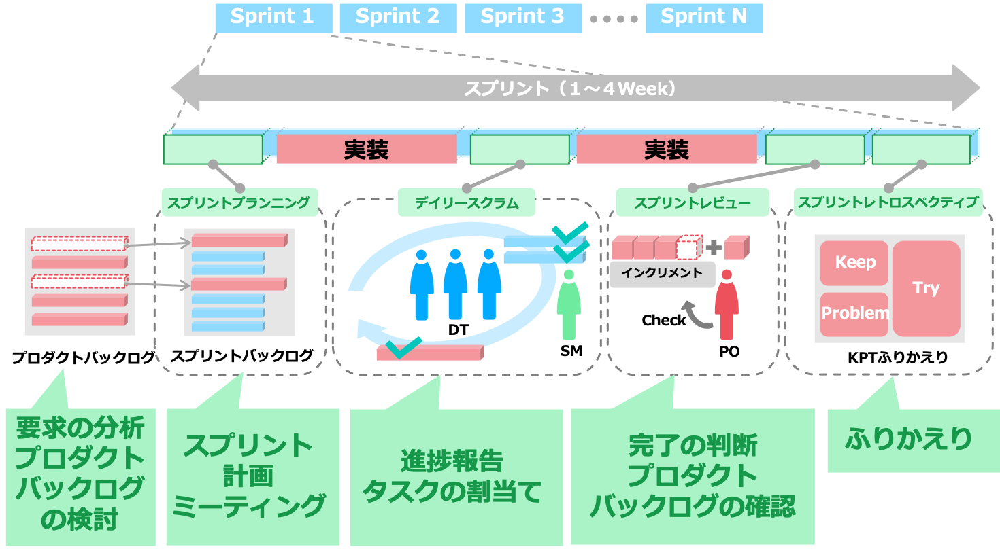
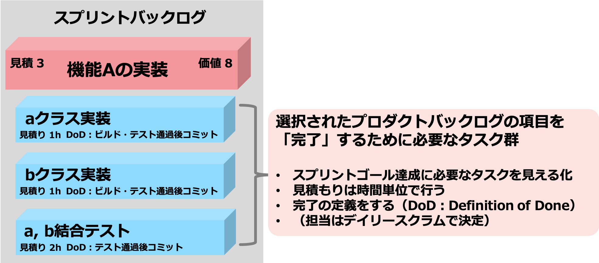
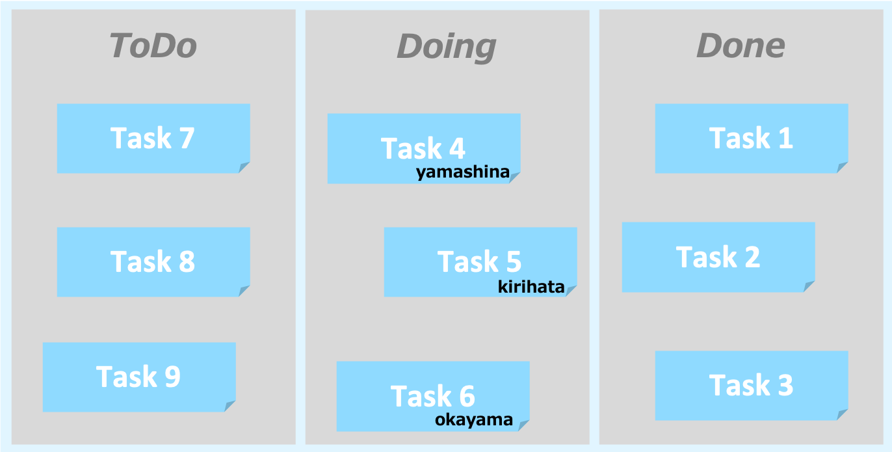
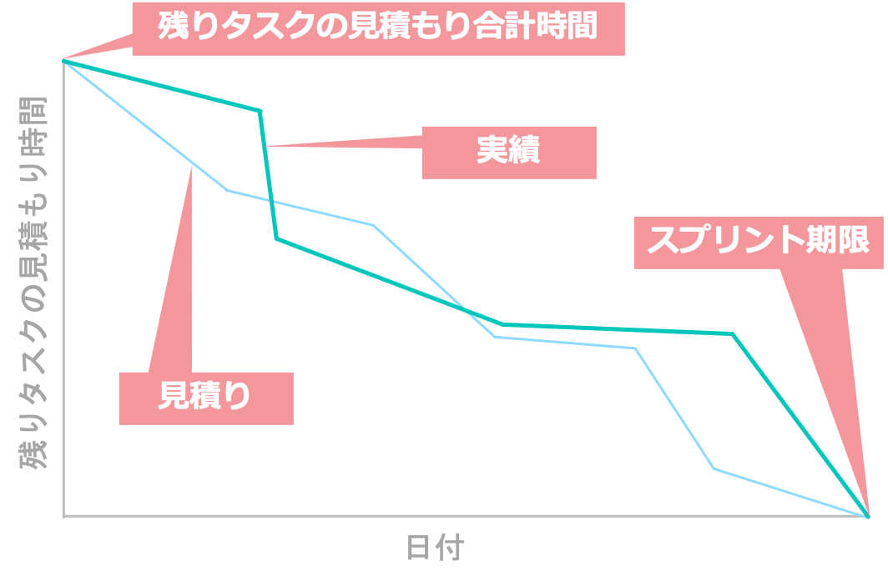

# Scrumを用いたチーム開発

## スプリントの実践方法
スクラムでは、1スプリント当たりにタイムボックスという制限時間を設けます。  
通常は1週間〜1ヶ月と、ほとんどは1ヶ月以内で行われます。それ以上になると、  
仕様変更によって開発の手戻りが増大する可能性があります。  
スプリント内での目標をスプリントゴールといいます。  

次に、スプリントを構成するイベントを行う順に見ていきましょう。

1. スプリントプランニング：計画
   - スプリント内で何を開発するかを決定する会議
2. デイリースクラム：開発の進捗確認
   - 1日1回行う、チームの状況把握・プロダクトの再認識を行う会議
3. スプリントレビュー：開発物の確認、仕様再定義
   - 開発物の動作確認、プロダクトバックログの再確認
4. スプリントレトロスペクティブ：ふりかえりと改善
  実施スプリントのふりかえりと次の改善策を検討

それでは、各イベントを詳しく学んでいきましょう。

### スプリントプランニング
スプリントプランニングは各スプリントの始めに行う作業計画のための会議のことです。  
プロダクトバックログ(要求リスト)から、スプリントバックログ(開発項目詳細)を作っていきます。  

その1：スプリント内に何を開発するか（プロダクトバックログから選択）

プロダクトバックログから、今回のスプリントで何を完了させるか(スプリントゴール)を決めます。  
そのために、優先順位が必要になるので、プロダクトバックログに価値と見積もりをつけていきましょう。  
価値は数字が大きければ大きいほど重要度が高く、見積もりは大きいほど作業量が多くなります。  

数値で決定が難しいという場合は、まずは大きく高・中・低の3つで分類したあとで数値に分類する方法もあります。  
ここで、価値と見積もりを適切に設定する方法の一種として、**プランニングポーカー**という方法があります。  

**プラニングポーカー**
- 各自が1, 2, 3, 5, 8, 13, ...といった数字（フィボナッチ数列の数）の付いたカードを持ち、プロダクトバックログの項目やタスクに対してカードを出す
  - カードを出す前に基準となる課題とその見積ポイントを合意しておく（頭合わせをしておく）
- 数字がそろった場合：見積ポイント決定
- 数字が合わない場合：Max と Minの人が見積理由を話し、再度全員がカードを出す
  - Maxを出した人 : 難易度・リスクを知っている
  - Minを出した人：スマートなやり方を知っている
- さらに合わない場合はあらかじめ決めたルールに基づき決定（例：Max値を採用/平均をとる）

その2：対象をどのように開発するか（スプリントバックログ：タスク切り分け）  

これで今回のスプリントで何をするか決定しました。  
しかし、リストの中から選択できたとしても具体的に何をしたらいいかまだ決定していません。  
そこで、プロダクトバックログをより詳細に分けたスプリントバックログを作成します。  
これは、開発チームが中心となって行います。例えば、機能Aを実現するためにはXできるクラスが必要だとか、  
それを実装したらテストが必要など、洗い出していきます。  

ここで重要になるのが、タスクがどのくらいの期間で完了するか、そして、完了の定義です。これはチーム全体で共有が必要です。

### 実装
このスプリントでやることが決まりました。では実際に実装スタートです。  
各自これまでに洗い出したタスクから作業に着手します。  
実装を進める上で重要になるのは、誰がどのタスクを処理しているのか。  
今どれくらいタスクが終わっているのか。タスクに遅れやその他問題が生じていないか。  
これをチーム全体で共有し、各自が把握しておくことです。その方法がデイリースクラムです。  

### デイリースクラム

実装期間中、問題が浮上したり、認識のすれ違いが発生したりする可能性があります。  
そこで、デイリースクラムという集会を毎日行って、チームの状況を把握します。  
朝に行えば朝会、昼なら昼会と呼称することもあります。

デイリースクラムは必ず15分と決まっており、話し合う項目は以下の3つです。

- 前回のデイリースクラムから行ったこと
- 次回のデイリースクラムまでに行うこと
- 問題点をあげる(対策は別の機会を設けて実施)

その際に使用するのが、カンバン(タスクボード)です。  
カンバンは、スプリントバックログをToDo(これから取り組むこと)、Doing(今作業していること)、Done(終了タスク)に  
分けて見える化したもので、誰がどの項目に取り組んでいるかが一目でわかるようになっています。  

カンバンを使って、進捗状況や向かっている方向がずれていないか確認します。  

なお、デイリースクラムが15分を超えるような場合、例えば、方向ずれの修正や発生した問題への対策を協議するような場は  
改めて二次会として必要なメンバを集めて行います。

### スプリントレビュー
スプリントレビューとは、スプリントの終わりにインクリメント（開発物）の動作確認と、  
必要に応じてプロダクトバックログの再確認を行います。  
具体的には、プロダクトオーナーが**何が完了し、何が完了していないか**を明確化します。  
その際、動作確認で重要となるのは「動くもの」です。  

### スプリントレトロスペクティブ（ふりかえり）

スプリントレトロスペクティブは、次のスプリントの改善計画を立てるために行うふりかえりのイベントです。

特に下記のような目的があります。

- 人・関係・プロセス・ツールの観点から今回のスプリントを振り返る
- うまくいった項目や今後改善が必要な項目を整理する
- チームの作業の改善の計画を立てる

こうした話し合いを円滑に行うために、ふりかえりの方法を事前に決めておくと良いでしょう。  
ふりかえりのフレームワークの代表的なものにKPTがあります([チームビルディングの事前資料](https://led-camp.github.io/camp10/pre_learning/0_teambuilding/2_team_review.html)で既出ですが、復習)。  
KPTは各メンバがKeep、Problem、Tryの三つの軸に沿ってふりかえりを行います。  
イベントにおいてProblem（タスクの遅延など）が出た場合、個人差を考慮し、  
チームとしてのサポート体制を改めて再検討し、改善案を出します。  

KPTの重要性に関しては事前学習の「チームビルディングの理論と実践 & 合意形成」"[ふり返りと分かち合い](https://led-camp.github.io/camp10/pre_learning/0_teambuilding/2_team_review.html)" をご参照ください。

Scrumではここまで紹介した4種類のイベントを反復しつつ開発を進めて行きます。

## スクラムで使えるツール
デイリースクラムでは、カンバン(タスクボード)を紹介しました。  
しかし、それ以外にも進捗を見える化できるツールがいくつかあります。  
Camp当日、下記のツールをチームで使用するかどうかは皆さんにお任せします。興味がある人は調べてみてください。  

**A. リリースバーンダウンチャート：プロジェクト全体の進捗を見える化**
スプリント毎のプロダクトバックログの難度の合計の見積りと実績をプロットしたもの

**B. スプリントバーンダウンチャート：スプリントの進捗を見える化**
スプリント毎に残りタスクの見積り時間において作業見積りと実績をプロットしたもの

