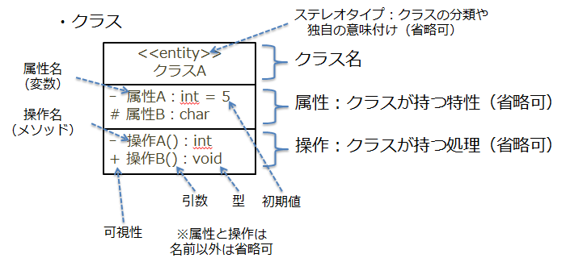
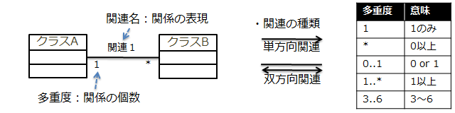
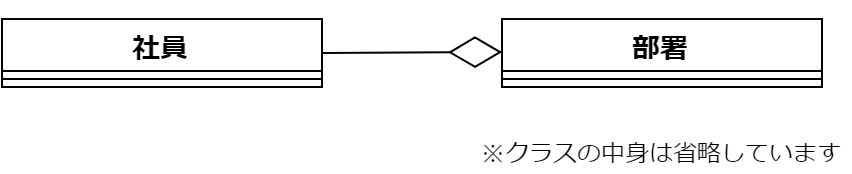
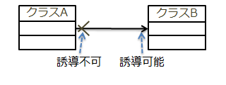
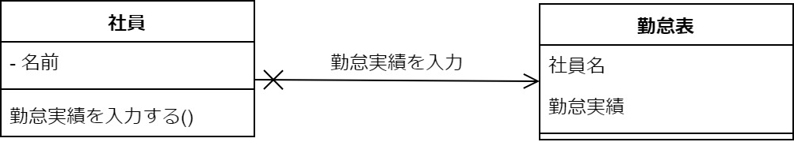
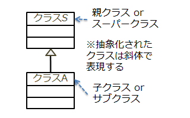
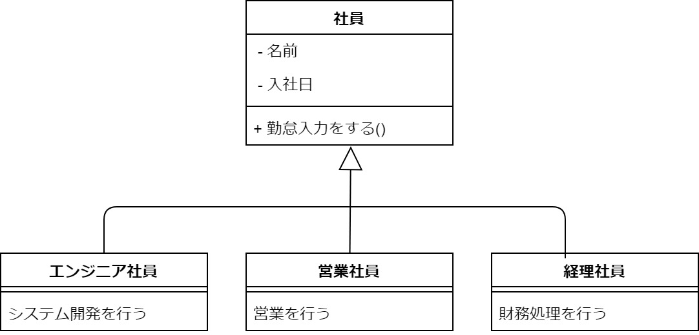
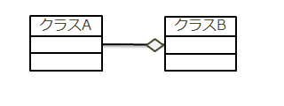

# クラス図概要

クラス図は、システムの静的な構造を表現するためのモデルであり、オブジェクトの情報を抽象的に定義します。  
また、クラスにはデータや処理に対応する属性や操作の情報を表現でき、  
個々のクラス間のつながりにも様々な種類の関係を表現することができます。  

**可視性の種類**

| 記号 |   表現    |                  意味                  |
| ---- | --------- | -------------------------------------- |
| ＋   | public    | すべてのクラスからアクセス可           |
| －   | private   | 自クラスのみアクセス可                 |
| ＃   | protected | 自クラスとその子クラスからアクセス可   |
| ～   | package   | 同一パッケージ内のクラスからアクセス可 |

**データ型の種類**

下記はプログラムを作成する際にしばしば使用するデータタイプの名前です。  
(プログラミング言語によっては名前が違う場合もありますが、似たようなタイプがあることがほとんどです。)

|  型名  |       内容       | データ幅 |
| ------ | ---------------- | -------- |
| int    | 整数             | 4 byte   |
| float  | 単精度浮動小点   | 4 byte   |
| double | 倍精度浮動小点   | 8 byte   |
| char   | キャラクタ       | 2 byte   |
| void   | データタイプ不定 | xxx      |

## 関連：クラス同士の関係

クラス間の結びつきは、**"関連"※**で表現します。
※ここでいう、**関連**は、クラスとクラスの間の双方向の意味的な接続を表す関係のこと

**関連の例**

## 誘導可能性：関連の一方向性

**誘導可能性の例**

## 汎化：クラスの抽象化

サブ（下位）クラスがスーパー（上位）クラスの一種である関係を表現します。  
これは 「 is a 」関係とも言います。（例：The bus is a car.）  

**汎化の例**

## 集約：全体-部分の関係

多数あるクラスをまとめのクラスを表現します。また、双方の間に「全体－部分」の関係があります。 

**集約の例**

クラス図をモデリングする際は以下の点に注意すると良いでしょう。

1. **一つのクラスには一つの責務を持たせる**
   - 複数の責務を持つクラスは分割する 
      - 1つのクラスが複数の責務を持つと,処理が複雑になる, 
        影響範囲が分かりにくいなど,多くの場合で問題が起こるため
2. **継承関係・依存関係はできるだけシンプルにする**
   - 多重継承を持たない
   - 循環参照を持たない
   - 所有関係を考慮する(集約)
3. **今回のみの制約：m2tプラグインが未対応なので、使用しないこと**
   - 集約とコンポジションは反映されない
   - 双方向の関連は持たない
