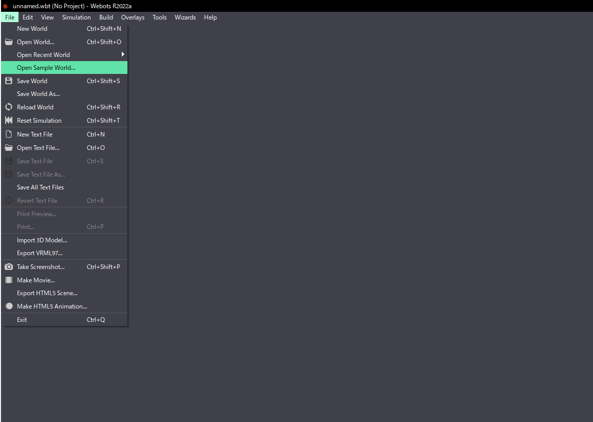
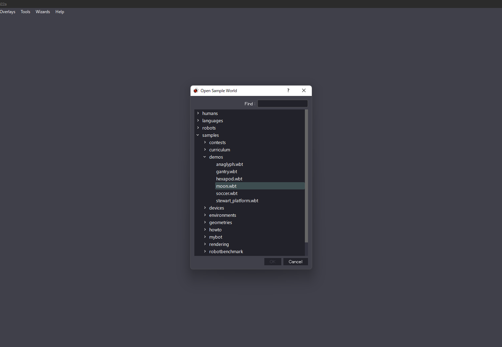

# Webotsのインストール
**Webots**はオープンソースの3Dロボットシミュレータです。 LED-Campではこちらを用いて、プログラムをビルド, 実行することによってロボットの動作検証を行います。
当日は作成したプログラムをWebots上で動かして、競技会を行います。

※画面は Mac のものです。

1. <a href="https://cyberbotics.com/" target="_blank" rel="noopener noreferrer">こちら</a>より、Webotsをダウンロードします。
2. インストーラを起動し、画面に従ってインストールを進めます。
3. Webotsを起動します。初回起動際には**Webots Guided Tour**が出ますが、Closeを押して無視してください。
4. サンプルプロジェクトを開いてみましょう。File -> Open Sample Worldと進みます。
    

5. samples -> demos -> moon.wbtを選択してOKを押します。
    

6. 以下の画像のような月のデモに切り替わります。
    

Webotsでは一つのシミュレーションプロジェクトの単位をWorldと呼びます。
wbtファイルにはシミュレーション中の全てのオブジェクトとその位置情報が格納されています。
このファイルをWebotsから開くことで、シミュレーションを他者に共有したり、途中から再開することができます。

LED-Camp9当日では実行委員で用意した、wbtファイルを読み込んで競技会とロボットを読み込んでいただき、そのWorld上でastahを用いて開発を行っていただきます。
