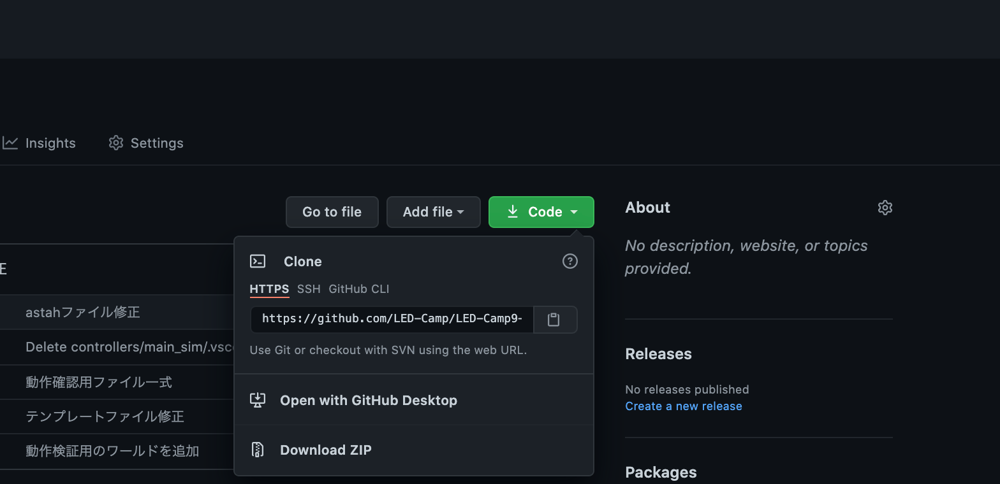
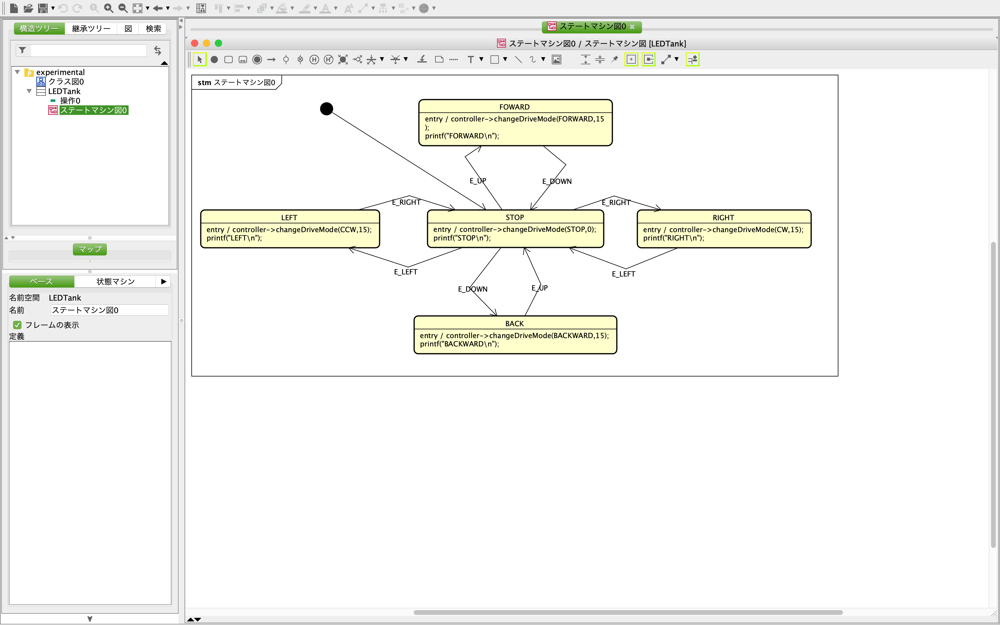
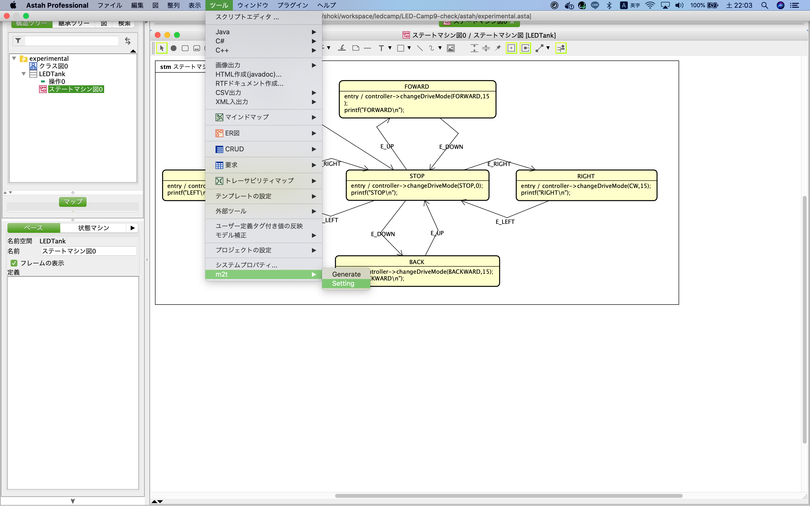
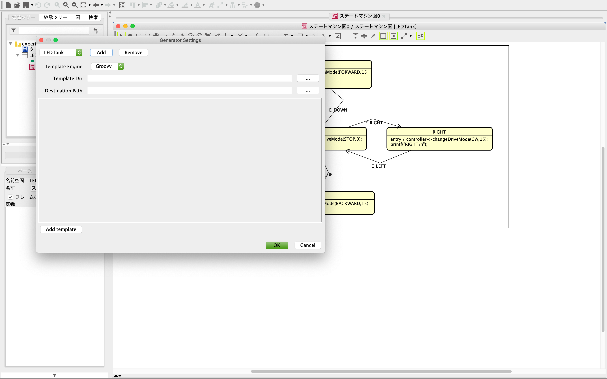
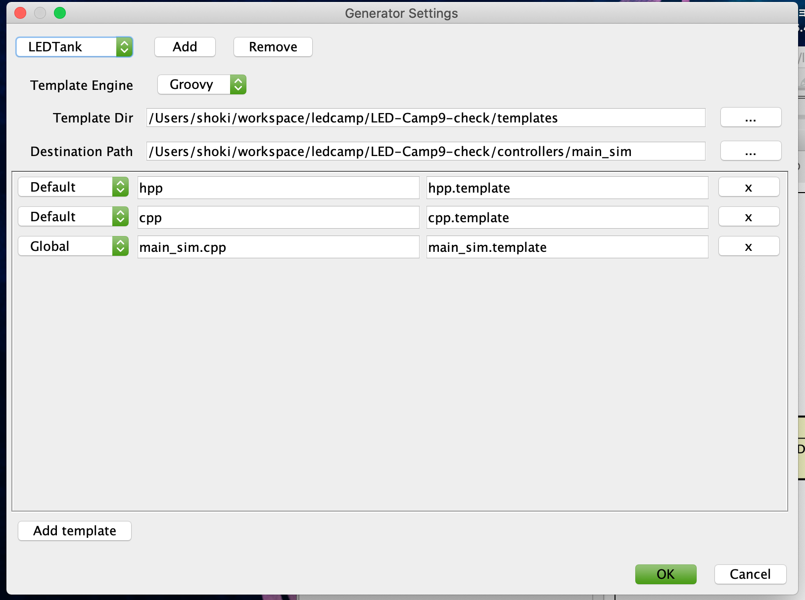
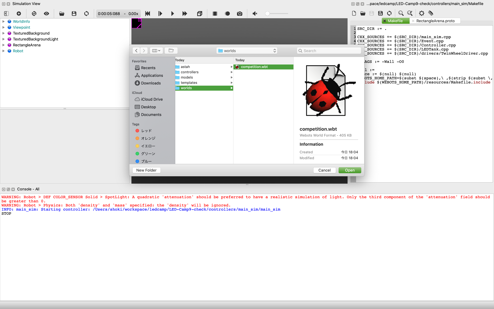
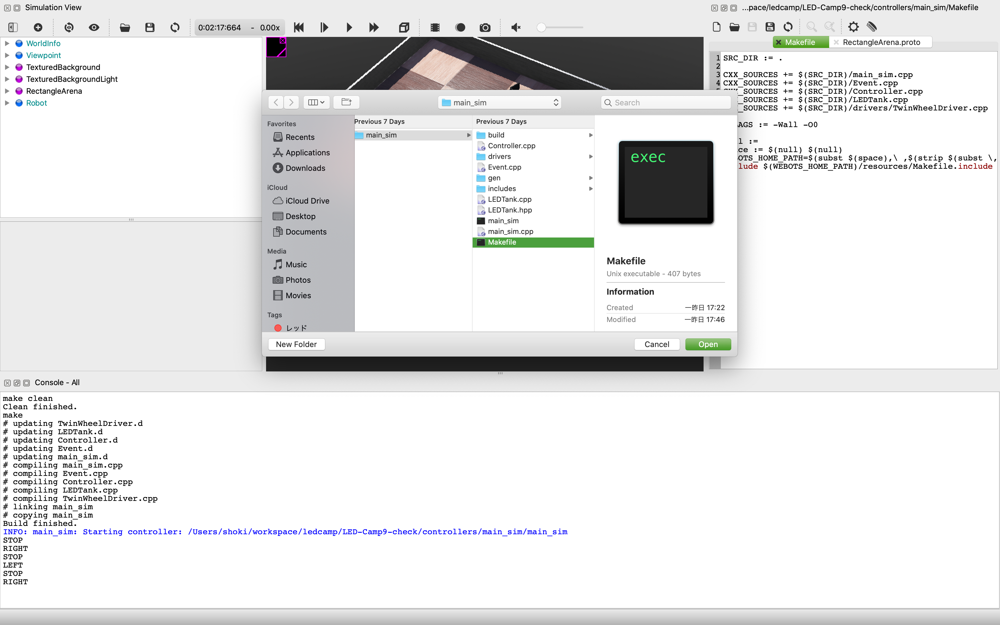
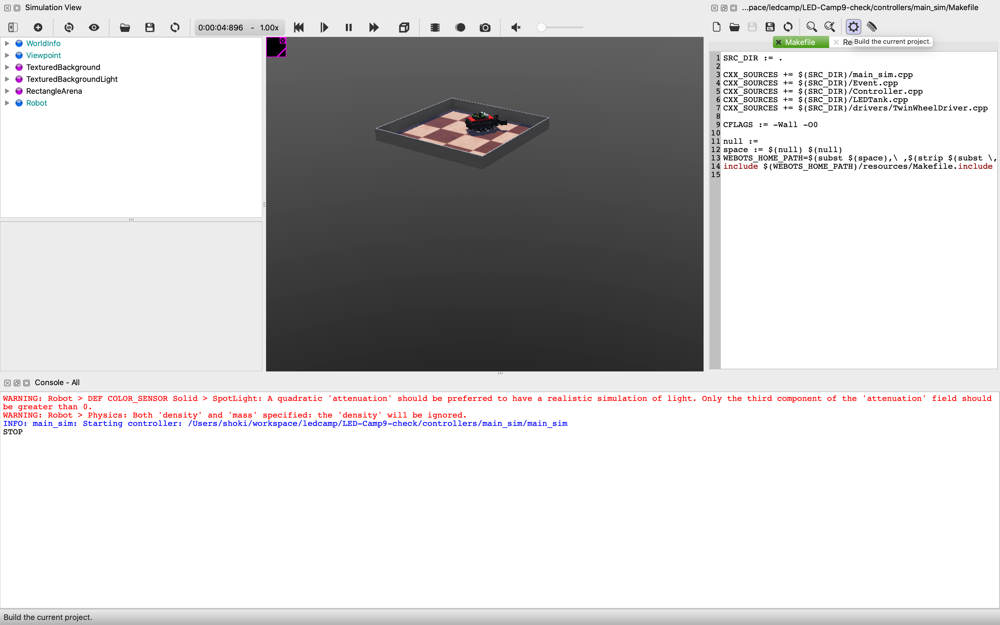
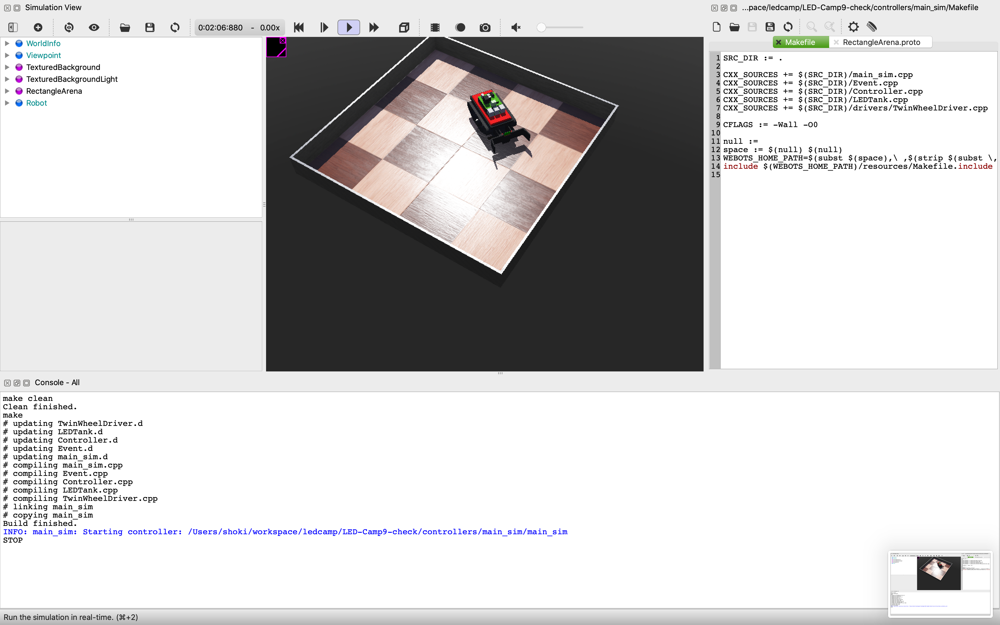

# 動作確認
ここでは確認用のファイル一式をダウンロードし、正しくセットアップが行われたかどうかの確認を行います。以下画面は Mac OS のものを載せていますが基本的に Windows でも同じです。


##  リポジトリのダウンロード
1. Windows の方は Git Bash、 Mac の方はターミナルを起動して作業用のフォルダを用意します。

```sh
mkdir ~/workspace
cd ~/workspace
```

2. 作業用フォルダに移動したら githubより、動作確認用のファイル一式を取得します。

```sh
git clone https://github.com/LED-Camp/LED-Camp9-check.git
```
### うまくgitが使えない方
<a href="https://github.com/LED-Camp/LED-Camp9-check" target="_blank" rel="noopener noreferrer">こちら</a>より zip ファイルをダウンロードできますので、**Download ZIP** をクリックしてダウンロードしてください。
<p></p>

## astah\* でサンプルモデルからコードを自動生成する
1. astah\* を起動します
2. ファイル->プロジェクトを開く を選択します。
    <p></p>
3. `astah/experimental.asta`を選択し、プロジェクトを開きます。
    <p></p>
4. 左側の構造ツリーからステートマシン図をダブルクリックし、状態遷移図が表示されることを確認します。
    <p></p>
5. 次に、ツール->m2t->Settingと進み、設定を行います。
   <p></p>
6. Add をクリックし、設定の名前を入力します(画像ではLEDTankと入力しています)。
    <p></p>
7. Template Dir には`templates/`フォルダを選択します。
8. Destination Path には`controllers/main_sim/`フォルダを選択します。
9. Add templateを3回クリックし、以下のように設定します。
    - default / hpp / hpp.template
    - default / cpp / cpp.template
    - Global / main_sim.cpp / main_sim.template
    <p></p>

10. ツール->m2t->Generateをクリックし、コードが自動生成されたことを確認します。
    <p></p>

正常にコード生成が行われない場合は、プラグインの設定を再度ご確認ください。

## Webotsでコードを動かす
1. Webotsを起動します。
2. File->Open Worldより`worlds/competition.wbt`を選択します。
    <p></p>
    <p></p>
3. 右のテキストエディタ部分には本資料に沿って進めて頂いている場合、前章で開いた`moon.wbt`のソースコードが表示されているかと思います。上部のファイルを開くマーク(Open an exsisting text file.)をクリックし、`controller/main_sim/Makefile`を選択します。
    <p></p>
4. 歯車のマークよりコードのビルドを行います。
    <p></p>
5. ビルドが成功したら3Dグラフィックの画面上部の再生ボタンを押して、シミュレーションを実行します(ダイアログが出たらResetをクリックします)。
    <p></p>
    <p></p>
6. 一度3Dグラフィックの画面をクリックし、W/A/S/Dを押すことでロボットが動作することを確認します。
    ※キーを1回押しても複数回反応することがあるので、その際はキーを押し込む時間を短くしてください。

# 最後に
お疲れ様でした。これでLED-Camp当日に必要なセットアップは全て完了となります。
