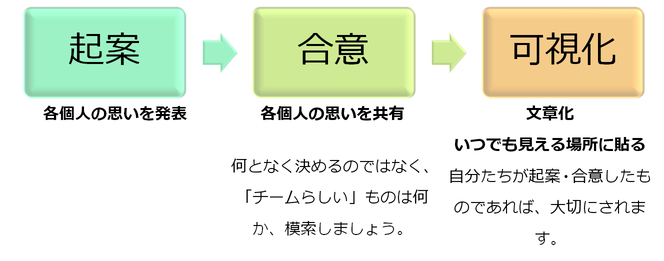
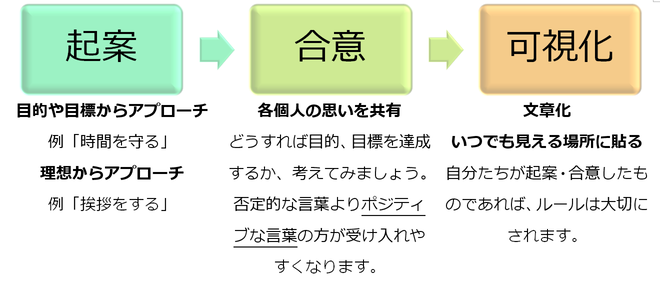
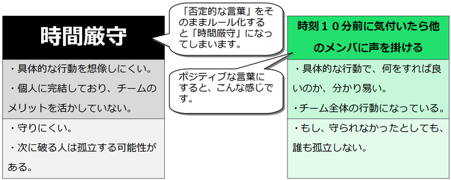

# ミッションとルール
source: `{{ page.path }}`

## 使命(ミッション)とは
自らの命を何に使うか、自ら決めることです。

ミッションの作り方、使い方を示します。

図. ミッションの作り方、使い方

ミッションを達成するために、もう一つ決めて欲しいことがあります。

## ルールとは
プロジェクト、チーム、ミーティングなどで設定する行動規範のことです。

チーム目標達成のため
機能するチームになるため
に設定します。

ルールの作り方、使い方を示します。

図. ルールの作り方、使い方

> 「否定的な言葉」で作ったルールと「ポジティブな言葉」で作ったルール  
> の違いを見てみましょう。  

## 例題・大遅刻事件
話に夢中になってしまった、時刻を勘違いしていた、などの理由で遅刻すると、時間にルーズだ、やる気がない、大人としての自覚が無い、と思われてしまいます。また、チーム全体が、或いはLED-Camp全体が「しらけ」ムードになるかも知れません。チームの目的、目標を達成できないかも知れません。この場合、どんなルールを制定すれば良いのでしょうか。

図. 例題・大遅刻事件

> 次は「ポジティブな言葉」で作ったルールの事例集です。  
> みなさんのルール作りの参考にしてください。  

## ルール事例集

 

<h2>6.4. ルール事例集</h2>

<table class="table table-bordered"><tbody><tr>
<td width="50%">
ルール事例 
</td><td width="50%">
狙い 
</td></tr><tr><td>
語りたい人が語る。 語りたい人は語らない人に強制しない。 語りたくない人は語る人の邪魔をしない。  
</td><td>
参加するしないは自分の意志で。 過剰な自己開示を防ぐ効果もあります。 
</td></tr><tr><td>
ここで語ったことは、ヨソでは語らないようにしましょう。 
</td><td>
ホンネのなかには部外者に知れると都合の悪い話もあります。 
</td></tr><tr><td>
ここで語らなかったことは、ヨソでは語らないようにしましょう。 
</td><td>
ここでホンネを出さず、あとで愚痴や陰口はいわないように、という意味です。 
</td></tr>
<tr>
<td>
意見の対立や食い違いをみんなで楽しみましょう。 

</td>
<td>
調和しないといけない（＝ホンネを抑える）という気持ちをはずしてあげます。 

</td>
</tr>
<tr>
<td>
強がりをいわず、自分の弱みを素直に見せましょう。 
</td>
<td>
タテマエとホンネをこういいかえるだけで、わかりやすくなります。 
</td>
</tr>
<tr>
<td>
肩書や立場を忘れ、自分のことは棚にあげましょう。 
</td>
<td>
責任という重しをはずすだけで、タテマエの発言が減ります。 
</td>
</tr>
<tr>
<td>
今日は結論を出したり合意したりすることはやめましょう。 
</td>
<td>
答えを出さないといけないという強迫観念をはずせば、気軽に話せます。 
</td>
</tr>
<tr>
<td>
今日はいいあう場ではなく、聴きあう場にしましょう。 
</td>
<td>
ランクの高い人が発言を独占するのを禁止するルールです。 
</td>
</tr>
<tr>
<td>
正論をいいすぎたり、相手をやっつけすぎたりしないようにしましょう。 
</td>
<td>
ヘコまされると、二度と話をする気がなくなります。 
</td>
</tr>
</tbody></table>

> 次は、理解度チェックです。  
> このページでの理解度を確認しましょう。 

## 理解度チェック

**項目1：チームのミッションとルールを説明できるか？**

**項目2：どんな表現にすれば、守り易く、誰も孤立せず、自分のチームらしいルールになるか、考えてみましょう**

<table class="table table-bordered"><tbody><tr><td width="50%">
起案時のルール 
</td><td width="50%">
合意時のルール 
</td></tr><tr><td>
時間厳守 （集合時刻、終了時刻） 
</td><td> </td></tr><tr><td>
アジェンダに集中する 
</td><td> </td></tr><tr><td>
建設的な意見を出す 
</td><td> </td></tr><tr><td>
ヒソヒソ話をしない 
</td><td> </td></tr></tbody></table>

> いよいよ、このテキストも終わりが近付いてきました。
> 私からみなさんにお願いがあります。