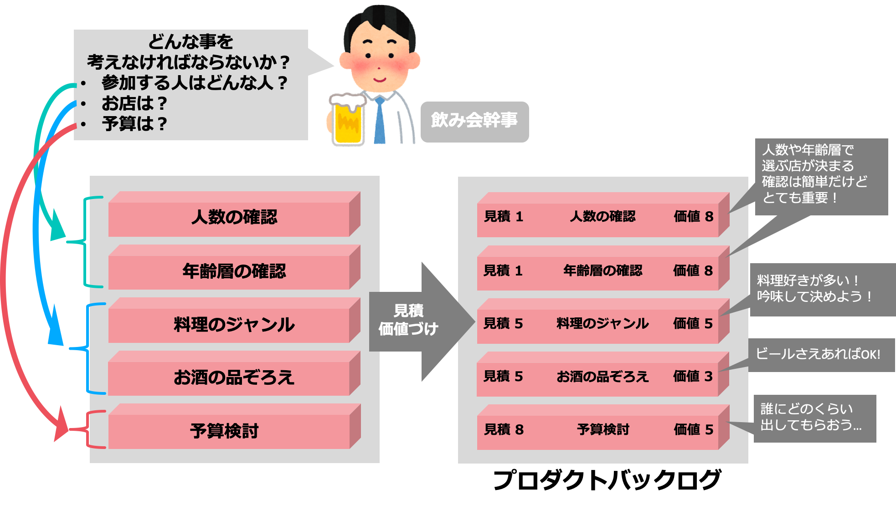
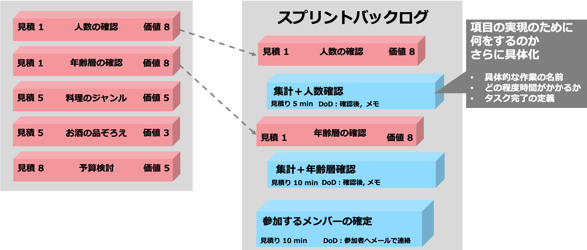

# 例を用いたScrumの実践
source: `{{ page.path }}`

ここでは具体的な例を用いてスクラムに重要な２種類のバックログを考えてみましょう。

Scrumを行うにあたり、スプリントバックログとプロダクトバックログの項目の検討は、特に重要な作業になります。したがって、プロダクトバックログとスプリントバックログの項目を決める例を示したいと思います。
例えば飲み会の幹事になったとしましょう。

上の図では、飲み会を開くにはどんなことを配慮すべきかを、分解して検討しています。その次に検討点を具体化し、価値付けを行うことでプロダクトバックログの作成を行っています。このように**プロダクトバックログの作成**は要求や要件の分析・具体化をして、項目に起こす作業です。また、見積と価値づけについては、図中にあるように項目の実現の難易度と、飲み会を開くために必要な項目か否かという風に切り分けて考えます。例えば、抜きんでてお酒の品揃えのいいお店を探すのはなかなか大変ですが、「ビールさえ飲めればいい！」というならば、価値は低くなりますね。

また、プロダクトバックログで決めた各項目の優先度に応じて、各スプリントでスプリントバックログに項目のタスク切り分けをします。

z

スプリントバックログではスプリントで取り掛かる項目を、どのように実現するかを決め、リストアップします。特に、プロダクトバックログからさらに具体化し、何をしたらどのような成果が上がるかを見える化します。またタスクの切り分けの際はどの程度の時間がかかるかを見積もります。
このように、最初は抽象度の高いところから徐々に具体化していき、最後は作業に結びつけていきます。

しかし、スプリントを回している最中に参加するメンバーから「次の日の関係から飲み会の場所を〇〇付近にしてほしい！」と言った話が出てきて...〇〇付近には決定したジャンルの店がない... といった問題が浮上するかもしれません。その際はどうしましょう？ジャンルを変更する？参加を断念してもらう？

2章でも述べましたが、スクラムは経験が重要になってきます。チームによって重要な事柄、タスクの切り分け方はそれぞれです。その時のベストを見つける必要があります。

「みんなでScrum!」の事前学習はこれで終わりです。

知識も必要だけど実践してみないとわからないということがわかったと思います。これを元に当日実践を通じて学んで行きましょう！
