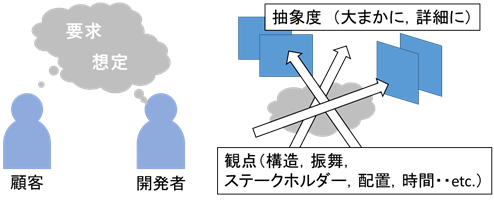
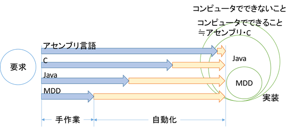
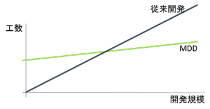

# モデル駆動開発 Part 1
source: `{{ page.path }}`

## モデル駆動開発とは
モデル駆動開発とは、従来のコードを主体とは異なり、モデルを主体とした開発手法です。
ソフトウェア開発技術は抽象化の歴史と言っても過言ではありません。

機械語からアセンブリ言語、C等の高級言語、オブジェクト指向言語という風に、機械の言葉からヒトの言葉に近づけてきました。

ソフトウェア開発とは、ヒトの求める要求をコンピュータ上で実行できるプログラムに変換する作業であり、上記のような抽象化はソフトウェア開発工程における要求と実装の間のギャップを埋めることにより人の思考に近い概念で開発を行うためのものです。

モデル駆動開発は詳細設計から実装までの工程を自動化することで、プログラミング言語よりも抽象度が高い開発を行うことができます。

もちろん何もかも自動で行ってくれる訳ではなく、自動化のための仕組みを作り、ドメインに応じたモデルを定義する必要があります。

モデル駆動開発は銀の弾丸ではありませんが、ドメインによっては非常に強力な武器になりえます。使いどころを見極めて導入を検討してみてください。

本稿では、モデル駆動開発の仕組みや導入方法などについて解説します。

## いろいろなモデル駆動開発

モデルからコードを生成するという広義のモデル駆動開発には、多くの手法が含まれます。

- **MDA（Model Driven Architecture）**
  - OMGの提唱するモデル駆動開発のアーキテクチャです。主要な考え方として、MOF（Meta Object Facility）四層構造や、PIM（Platform Independent Model）/PSM（Platform Specific Model）などがあげられます。UML仕様もMDAの枠組みで定義されています。
- **MDE（Model Driven Engineering）**
  - MDAをもう少し広義に捉え、モデルを用いた開発技術全般を指します。
- **MBD（Model Based Development）**
  - 意味的にはMDDと変わらないですが、一般にMatlab/Simulinkといった制御モデルを用いたコード生成を行う開発を指すことが多いです。制御系の開発に非常に有効でエンジン制御など車載システムの開発に多く導入されています。
- **MDD（Model Driven Development）**
  - 狭義にはMDAに沿うモデル駆動開発を指しますが、MBDと対比して、システムモデルに基づくコード生成を用いるものをMDDと呼ぶことも多いようです。
- **DSL/DSM（Domain Specific Language/Model）**
  - ドメインに特化した独自の言語やモデルを作成し、それらからコード生成を行う開発手法です。DSL/DSMと並ぶ場合は、DSMは多義を持ちますが、DSLはテキストベースの言語、DSMはUMLのようなグラフィカルなモデルを入力モデルとするものを指すことが多いです。両者をtextual DSL/graphical DSLのように表記することもあります。
- **DDD（Domain Driven Design）**
  - モデル駆動とは異なりますが、ドメインモデルを設計の中心に据えるドメイン駆動設計という設計手法が近年活気づいています。モデル駆動開発の枠組みを設計するうえでもとても参考になる考え方です。

業界によってもMDDとMBDは入り混じっていることも多いため、その人の指すモデルが何かを確かめながら話すといいように思います。本書ではUMLを用いたMDDを中心に解説します。

## モデルとは

対象をある観点と抽象度に基づいて情報を取捨し纏めたものをモデル、モデルを図面に落としたものをモデル図、モデルを作成することをモデリングといいます。

例えばUMLのクラス図は、ソフトウェアを構造の観点でクラスという抽象度で抽出したものです。

同様にステートマシン図は状態という観点で、クラス内部の抽象度で抽出したものとなります。

このように情報の取捨を行うことで、必要な情報のみに注力して考えることができます。

また予め分析する観点を決めておくことで、設計の抜け漏れを防ぐことができます。

ソフトウェア開発では多くの場合、様々なステークホルダーが関わってきます。

各々のステークホルダーが求めるシステムのイメージは必ずしも一致しているとは限りません。

このためモデルの段階でシステムの全体構成や機能について合意を形成しておくことで、システムが完成してからの齟齬を軽減することができます。

ソフトウェア開発では多くの場合、様々なステークホルダーが関わってきます。  
各々のステークホルダーが求めるシステムのイメージは必ずしも一致しているとは限りません。  
このためモデルの段階でシステムの全体構成や機能について合意を形成しておくことで、システムが完成してからの齟齬を軽減することができます。

## 抽象化と自動化

近年のソフトウェアの規模は、人が捉えるにはあまりにも膨大であるため、このような情報の取捨のためモデル化が必要となってきます。  
現在のスコープに不要な情報を排除することで、見たいものにだけフォーカスすることができます。

ソフトウェア開発とは要求を満たすソフトウェアを作成することです。  
上図に要求から実装までの自動化の度合いを示します（感覚的に描いたものなので、厳密には異なります）。  

当然コンピュータでできないことは、実装のしようがありません。  
要求分析の段階で、実現不可能なものは弾いておきましょう。  

アセンブリ言語はコンピュータでできうる事はおおよそ実装することができますが、実装には多くの工数が掛かってしまいます。

C言語はアセンブリ言語よりも抽象度が高く、ほぼアセンブリ言語と同等の範囲を実装することができます（できないこともありますが・・）。  
Java言語では、ダイレクトメモリアクセスができないなどいくつかの制約がありますが、C言語よりも抽象度が高く、より少ない工数で実装を行うことができます。  
MDDではさらにできる範囲は狭まりますがさらに少ない工数で実装を行うことができます。

## MDDのトレードオフ
MDDは対象のドメインを限定することにより、自動化を行います。  
簡単に言ってしまうとそのドメインでよくあるパターンをテンプレートとして、そのテンプレートにモデルをはめ込むことで、コードを生成します。

例えばWebシステムでデータベースにアクセスするコードやORマップのコードは、どのシステムでも似通っていますが、データベース構造に合わせて毎回作成する必要があります。  
このようなコードをクラス図で作ったデータベース構造から自動生成するイメージです。

当然、Webアプリを生成するためのMDDの枠組みを組込みシステムに適用することはできないため、ドメインに応じたMDDの枠組みを新たに作成する必要があります。  
このように自由度と自動化はトレードオフの関係にあります。  
対象としているソフトウェアが今後どのようにスケールするかを考えながら、MDDの枠組みを作成する必要があります。

変換ルールの作成には、モデルからコードへ手動で実装するよりも多くの工数が掛かります。  
一度きりの開発しか行わないシステムや一度しか使わないモデルでは、モデル駆動開発を採用するメリットは少ないです。  
モデル駆動開発を導入する際には、この初期投資と何サイクルで投資が回収できるかのトレードオフをよく考えることが重要です。

加えて、可変性のトレードオフも重要です。なんでも生成できる変換ルールを作るには無限の工数が掛かります。  
将来必要となる変更を見据えて、可変性の範囲を検討してください。

