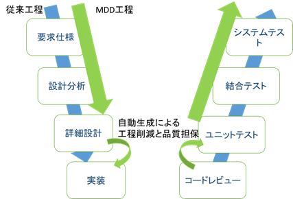
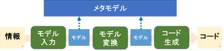
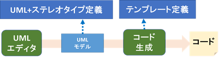
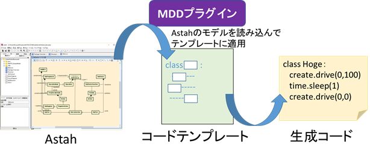

# モデル駆動開発 Part 2

## モデル駆動開発の仕組み

モデル駆動開発は、従来開発の工程の一部を自動化することにより、高い生産性を実現することができます。  
ここでは、従来開発との比較とモデル駆動開発の仕組みをみていきましょう。

上図に従来開発の開発工程と、MDDによる自動化される工程を示します。  
従来開発では詳細設計を元に手動にてコードの実装を行いますが、MDDではこの詳細設計のモデルからコードへの変換を定義しておくことで、自動化することができます。

コードレビューは主に詳細設計通りにコードが適切に実装されているか確認する工程ですが、自動生成では変換が適切に定義されていれば、モデルからコードへの変換では抜け漏れは起こりません。  
またコードテンプレートに従って生成されるため、コードフォーマットが崩れることもありません。

また繰り返し利用され十分に実績のある変換定義であれば、ある程度テストも削減することができるでしょう。  
このように人の手で行っていた実装という工程を変換として定義することで、人によるミスやブレを排除することができます。

当然、変換の定義にバグが混入することもありますが、繰り返し利用される変換定義を洗練することでコード品質を高めることができます。

## モデル駆動開発の工程

モデル駆動開発は開発のラインを構築する準備のフェーズと運用のフェーズに分けられます。  
準備フェーズでは、既存の開発工程を分析し、メタモデルの作成やモデルからコードへの変換を定義します。  
運用フェーズは下図のMDD工程となります。

以下の図でMDDの主要なプロセスを示します。

準備のフェーズでは、このうちメタモデル・モデル入力・モデル変換・コード生成の部分を準備し、何かしらの情報からコードまでの変換の流れを作ります。

運用のフェーズでは実際に情報を入力し、モデルに変換し、コードを生成します。

一方、UMLを用いたMDDではもう少しシンプルです。  
UMLによるMDDのプロセスを以下に示します。

準備フェーズでは、どのようなUMLとステレオタイプを用いるか検討し、コードを生成するためのテンプレートを定義します。  
運用フェーズではエディタでUMLモデルを書き、そのモデルをテンプレートに当てはめることでコード生成を行います。  

テンプレートを記述するには、予め生成したいコードのイメージとUMLのどの要素を使ってコードを生成するか検討する必要があります。

## モデル駆動開発の導入方法

前で述べた通り、モデル駆動開発の導入（準備）には、多くの工数が掛かります。  
一気に導入するよりも、導入しやすい箇所から部分的に導入し徐々に慣れていくのがよいでしょう。  
本章では導入についていくつかの方法を見ていきます。

### １．	既存製品への部分適用

同じような構造のクラスが大量にある場合や、特定のルールに従って繰り返し記述するようなコードがある場合は、その部分から適用してみるのがいいでしょう。  
似通ったコードの差分をとってみて、共通部分と可変部分を探してみてください。   
可変部分を整理して、メタモデルとコードテンプレートを作成できれば、以後の繰り返し作業は自動化することができます。

すべて自動化することが難しい場合は、できるだけ可変部分は小さくして、生成が難しい部分のみ手動で実装してもいいでしょう。  
場合によっては、DSLの方が小さい規模でさく導入しやすいでしょう。

### ２．	既存製品の差分開発

基本的に１．の作業とやることは変わりません。  
既存のコードや構造を分析し、共通部分・可変部分を抽出し、メタモデルとコードテンプレートを作成します。

この際メタモデルをドメインモデルのように業務全体を整理したモデルまで分析・改善できれば、より高度なMDDを実現できるでしょう。

ここでもすべて自動化するのではなく、自動化しやすいパッケージやコンポーネントに限って導入していくとよいでしょう。

### ３．	新規開発

新規開発で導入する場合、全く既存資産がない状態や、そのドメインの開発を行った経験のない状態での導入は難しいです。

既存製品の延長上や新バージョンの立ち上げ、先行研究開発などで既存資産を再整理して導入するのが現実的であるといえます。

新規開発で導入する際は、既存のアーキテクチャに影響されず、一度製品全体のアーキテクチャを見直すチャンスでもあります。

ドメインモデルをしっかりと作り、モデル駆動開発や今後の製品展開を見据えて、変更や保守に強いアーキテクチャを構成してください。

## 今回のMDDの仕組み
astah*は機能拡張のためにプラグイン機能を提供しています。

プラグインを作成することで、astah\*で編集中のモデル図へのアクセスやastah\*にメニューを追加することができます。

今回作成したMDDツールもプラグインとして作成し、編集中のモデル図からモデル要素を抽出し、コードテンプレートに適用することでコード生成を行っています。

プラグインは通常Javaで作成するのですが、今回はJavaのコードを生成できる軽量VM言語であるXtendを用いて実装しています。

またテンプレート部分はスクリプト的にあとから編集可能にするためGroovyのコードテンプレート機能を利用しています。