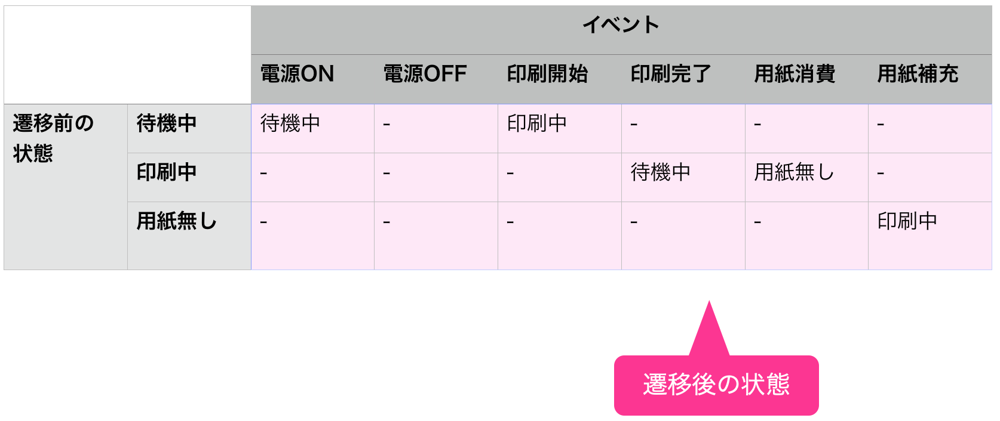

# ステートマシン図概要
source: `{{ page.path }}`

ステートマシン図は、クラス(オブジェクト)の状態と遷移を表現するためのモデルです。  
ある状態から別の状態への遷移を表現することができます。  
また、遷移を起こす契機や遷移を行うかの判断条件を表記することができます。  

**ステートマシン図の例**

あるプリンターには「待機中」「印刷中」「用紙無し」の各状態があります。  
これらの状態の遷移をステートマシン図で描くと以下の通りになります。  

ステートマシン図は、下記に示すステートマシン表（状態遷移表）で表すこともできます。

ステートマシン図に抜けや漏れがないか確認するためにも、ステートマシン表に置き換えて、別視点からチェックすることをオススメします。

**ステートマシン図とフローチャートとの違い**

ステートマシンを作成する際に、やりがちなミスとしては、フローチャートとの混同です。  
下記にフローチャートとステートマシンの違いについて記します。

下の図はステートマシン図(左)とフローチャート図(右)です。  

ステートマシン図では、箱内(青四角)に現状の**状態**を記述しており、次の状態に移る際は  
明示的にイベント(遷移条件、トリガー)を記載する必要があります。

一方、フローチャート図では、箱内に**処理**そのものを記述し、  
次の処理に移る際はイベントの記述は不要ですが、  
一連の処理が完了後、グラフ内のノードからノードへ自動的に遷移します。

参考：http://agile.blog.jp/agile_scrum/14997628.html

ステートマシン図をモデリングする際は以下の点に注意すると良いでしょう。

1. 基本的に、イベント、ガード条件、entryアクションで記述してゆくこと
   - 遷移アクション、doアクション、exitアクションはとりあえず使わない
   - トリガーが発生してもガード条件が満たされない場合は遷移しない
   - トリガー省略時は状態のexitアクションが実行されたら自動的に遷移する
2. 非決定な遷移を含めないこと
   - 同じイベント・ガードで複数の遷移を持たせない
   - 同じイベントが来た際、次の状態が非決定にしない
3. フローチャートにしないこと
   - ステートマシンは状態を捉える図なので、処理手順を書き並べるような図にしない