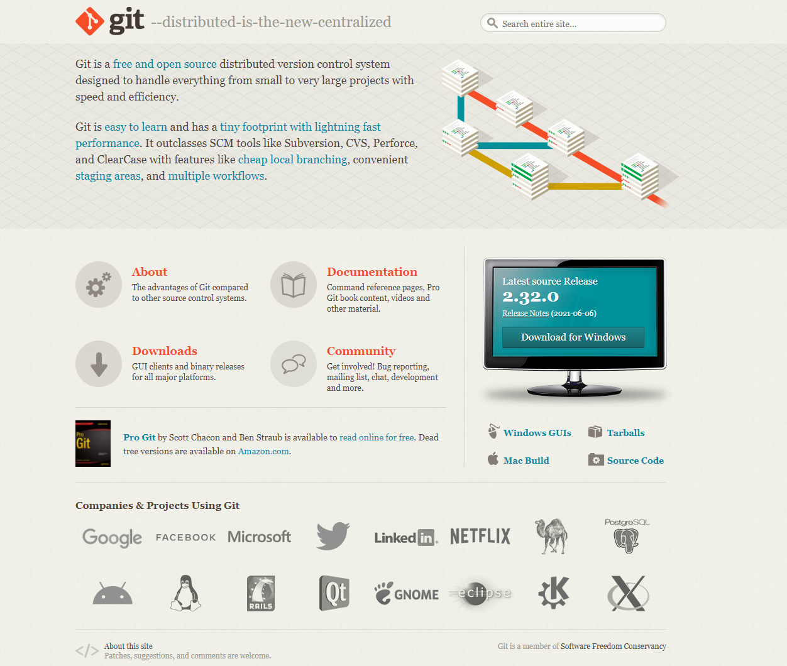

# (Windows) 実習環境の構築
このセクションでは実習を円滑に行って頂くためのツール群のインストールを行います。
もし入っていない場合はご参考いただけると幸いです。

## エディタ

[こちら](https://code.visualstudio.com/)よりVSCodeのダウンロードページにジャンプしますので、画面に従ってDownloadからインストールまで行ってください。

その他ご自身の使いやすいエディタがあればそちらをお使い頂いて構いません。

## git/github
LED-Camp9で使用するソースコードはgithubで共有します。
また、チームメンバとコードの共有を行う手段としてもお使い頂けます。
gitの操作に不慣れな方はGoogleDriveでも共有の場を設けますので、そちらをお使い頂くことも可能ですが、当日チームの方針によってはgitを使用する場合もあるかと思いますので、セットアップは行っておきましょう。

gitコマンドがあるかどうかの確認と、githubアカウントを用意します。

### git for Windows
1. [こちら](http://git-scm.com/)より、`git for windows` のインストーラをダウンロードします。
    <p></p>
2. インストーラを起動し、画面に従いインストールを進めます。
    - 全てデフォルトのまま next を押してください。
3. インストールが完了したら、`Git Bash` を起動するとターミナルエミュレータが開きます。この上でgitコマンドが使えるようになります。

### github
すでにgithubアカウントをお持ちの方はスキップしてください。

githubアカウントをお持ちでない方は[こちら](https://github.co.jp/)より、アカウントの作成(サインアップ)をお願い致します。無料のアカウントで十分です。

### 作成したgithubアカウントをgit for Windowsに登録する
gitコマンドにgithubアカウントを設定しておきましょう。

```
git config --global user.name [Your User Name]
git config --global user.email [Your Email]
```

以下は例になります。
```
ex)
git config --global user.name sho-hama
git config --global user.name xxx@gmail.com
```

## Discord
当日の実習はDiscordを用いて行います。
[こちら](https://discord.com/download)よりWindows版のDiscordをDownloadし、インストールをお願いいたします。

当日はビデオONの状態にすることもありますので、**必ずスピーカ、マイク、カメラをご用意** の上、動作確認を事前に行って頂きますようお願い致します。
