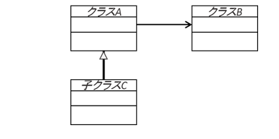
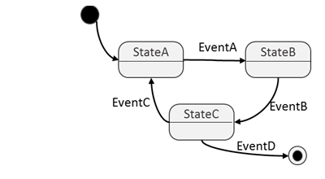

# UMLの概要

本パートからはこれまで、議論してきた「モデル」を可視化し、設計者間でのコミュニーケーションを
効率化するためのUMLについて学びます。

## UMLの成り立ち

1990年代にいろいろなソフトウェア開発手法が発案され、同時にいろいろな表記方法が提唱され、これらが乱立しました。  

そこで、このままでは良くないということで、統一方法論(Unified Process)とUML（Unified Modeling Language＝統一モデリング言語）が制定されました。  

UMLは、言語といっても、自然言語やプログラミング言語のような文字の記述を行うのではなく、図形の組み合わせ（モデル）により、ものごとの「観点」を表現します。   

UMLでの表記においては、対象とするソフトウェアを大きく2種類の観点でモデルとして記述します(下記)。  

（１）構造モデル  
（２）振る舞いモデル  

構造モデルでは、対象とするソフトウェアの静的な全体像あるいは、部分をいろいろな側面から見たものを図式化します。
これに対し、振る舞いモデルでは、対象とするソフトウェアの動的な全体像あるいは、部分をいろいろな側面から見たものを図式化します。

## 構造モデル

構造モデルは抽象度により、異なるモデルが定義されています。

<table class="table table-bordered"><tbody><tr><td rowspan="6" style="text-align:center; vertical-align:middle"> <b>高</b> ↑  <b>抽 象 度</b>  ↓ <b>低</b></td><td>• Deployment Diagram：配置図 </td></tr><tr><td>• Component Diagram：コンポーネント図 </td></tr><tr><td>• Composite Structure Diagram：複合構造図 </td></tr><tr><td>• Package Diagram：パッケージ図 </td></tr><tr><td>• Class Diagram：クラス図（LED-Campで使用する） </td></tr><tr><td>• Object Diagram：オブジェクト図 </td></tr><tr><td colspan="2"> </td></tr><tr><td style="text-align:center">別観点</td><td>• Profile Diagram：プロファイル図 </td></tr></tbody></table>

## 振る舞いモデル

振る舞いモデルはそれぞれ異なる観点で作成するモデルです。

- Use Case Diagram:ユースケース図：外界との関係,要求
- Activity Diagram:アクティビティ図：システムフロー
- State Machine Diagram:ステートマシン図（LED-Campで使用する）：状態とその遷移
- Interaction Diagram:相互作用図
- Sequence Diagram:シーケンス図：オブジェクト間フロー
- Communication Diagram:コミュニケーション図：オブジェクト相互関係
- Interaction Overview Diagram:相互作用概念図：図間のオーバービュー
- Timing Diagram:タイミング図：動作タイミング

## LED-Campで用いるモデル

LED-Campの実習では、下記の図をモデリングに使用します。

**構造モデル → クラス図**

**振る舞いモデル → ステートマシン図**

組み込みシステム開発や制御プログラム開発において、適度な抽象度で部品化した構造を持たせ、その状態のモデリングが重要です。  

静的には、部品と部品間の関係を綺麗に揃えるのが重要なのでクラス図を、動的には、状態とその遷移を把握するのが重要なのでステートマシン図をそれぞれ使用します。  

今回、LED-Campで使用する移動ロボットのような動きものであれば、「どういう状態であるか？」、「いつまでその状態であるか？」が書きやすいです。  

