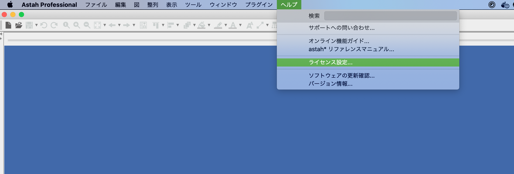
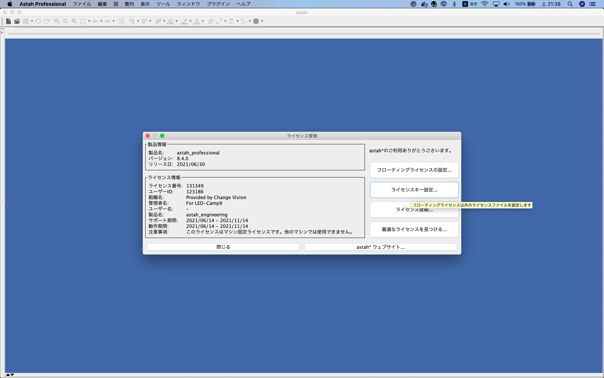
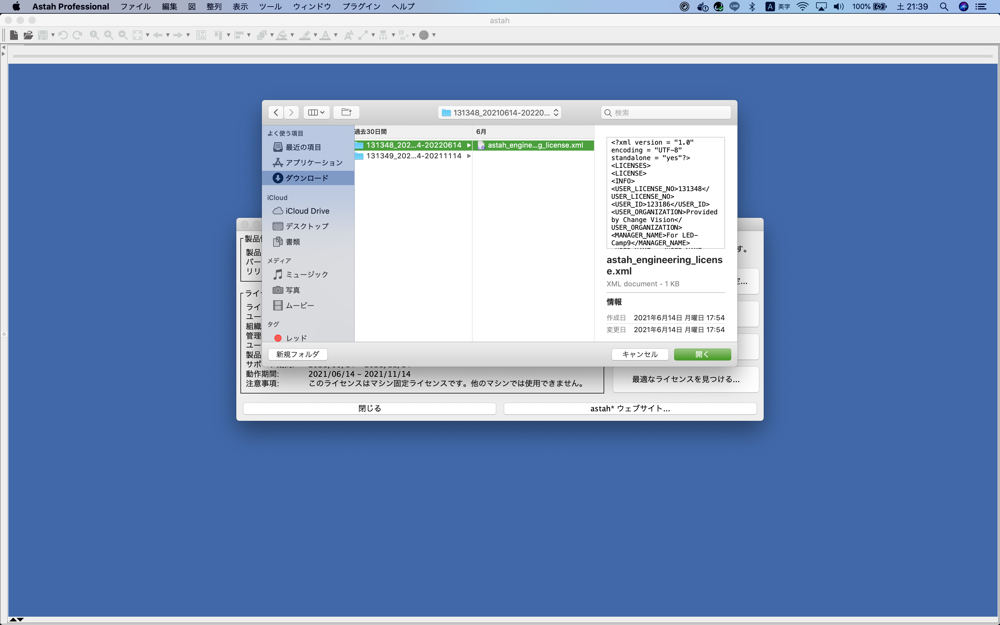
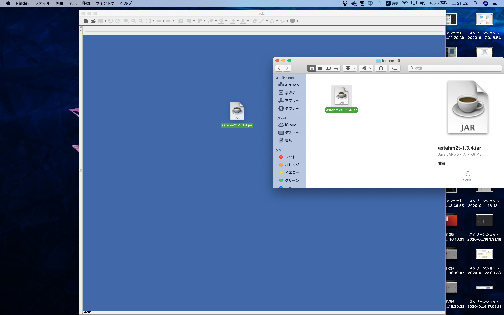
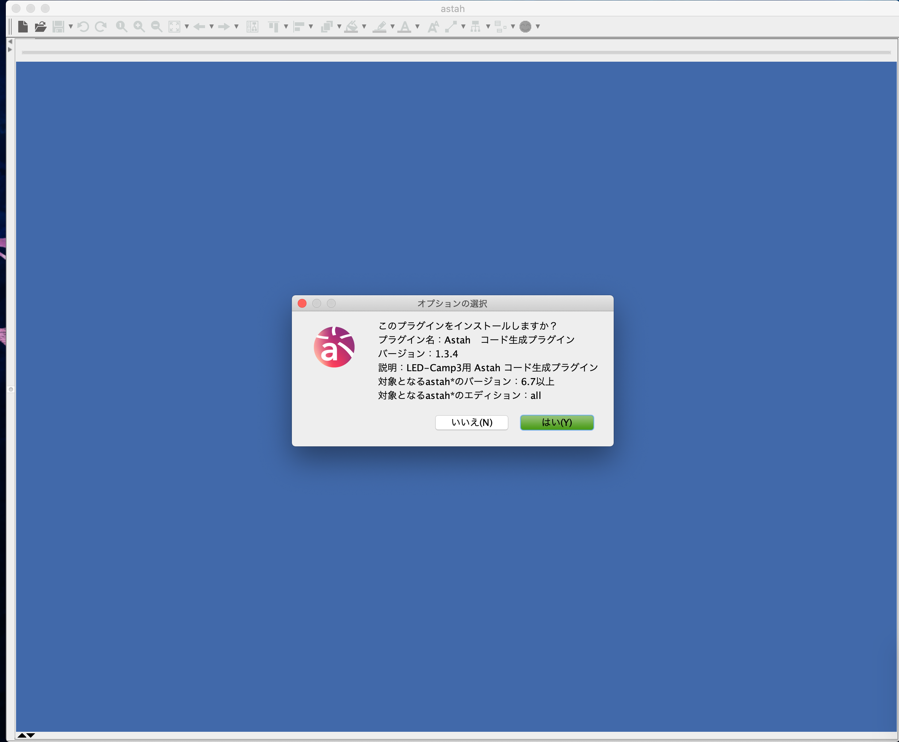
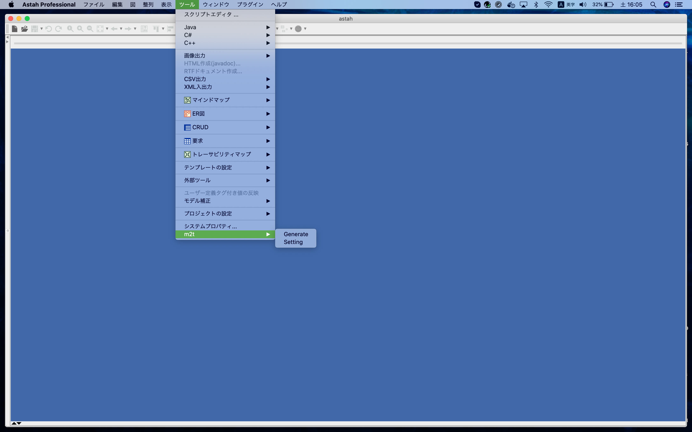
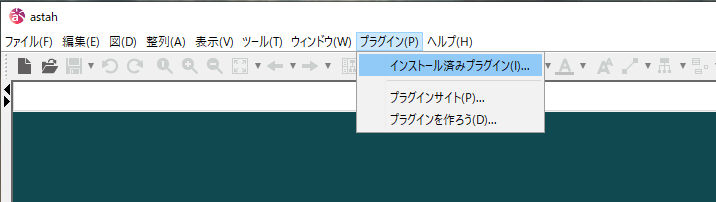
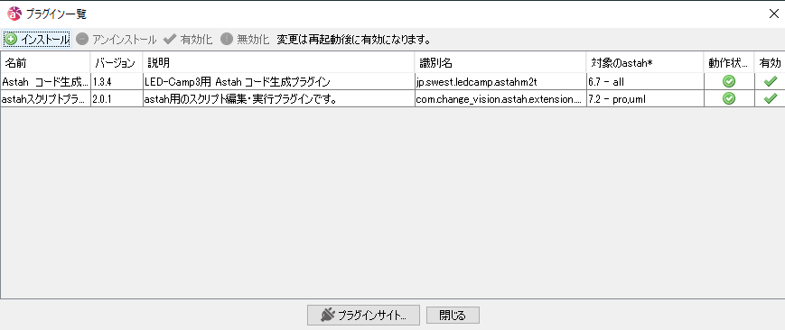

# astah のセットアップ
astah とは様々な UML を簡単に作図できるツールです。
astah 上で作図したモデルから実際のプログラムに自動変換することもできます(プラグインが必要)。

※画面は Mac のものです。

## astah professional のインストール
1. [こちら](https://astah.change-vision.com/ja/download.html#professional)より`astah professional`をダウンロードしてください。
2. ダウンロードしたインストーラを起動して、画面に従ってインストールを完了させてください。

## ライセンスの適用
astah を使用するためにはライセンスが必要です。メールでライセンスファイルはお送りしておりますので、添付のzipファイルをご確認ください。

本ライセンスは、今回のLED-Campのために用意したastah エンジニアリングパックの期間限定ライセンスです。

astah エンジニアリングパックでは、LED-Camp で使用する astah professional 以外に astah SysML やastahGSN も利用可能です。LED-Camp 終了後も有効期間中は astah 製品を使用することができますので、是非ご活用ください。

1. メール添付のライセンス zip ファイルを展開します。
2. astah を起動します(Windowsの方は**管理者で起動**してください)。
3. ヘルプ -> ライセンス管理 と進みます。
    

4. ライセンスキー設定 を選択します。
    

5. 展開した astah ライセンスファイルを選択します。
    

## m2t プラグインを astah* にインストール
m2t は astah のプラグインの一種であり、設計したクラス図などからモデルのソースコードを自動生成することができるようになります。

公式で使い方が紹介されているので[こちら](https://astah.change-vision.com/ja/feature/astahm2t.md-plugin.html)も併せてご参考ください。

1. [こちら](https://astah.change-vision.com/plugins/astahm2t/1.3.4.html)より jar ファイルをダウンロードします。
2. jar ファイルを、astah 上へドラッグ & ドロップします。
    

3. プラグイン概要のダイアログが表示されるので「はい」を選択します。
    

4. astah を再起動します。
5. ツールに m2t が現れていれば完了です。
    

### Windows の方
公式のドラッグ & ドロップ方式ではうまくいかない可能性がありますので、その際は以下の方法をお試しください。

1. [こちら](https://astah.change-vision.com/plugins/astahm2t/1.3.4.html)より jar ファイルをダウンロードします。
2. プラグイン->インストール済みプラグイン を選択します。
    

3. インストールをクリックします。
    

4. ダウンロードしたjarファイルを選択します。
5. astah を再起動します。
6. ツールに m2t が現れていれば完了です。
