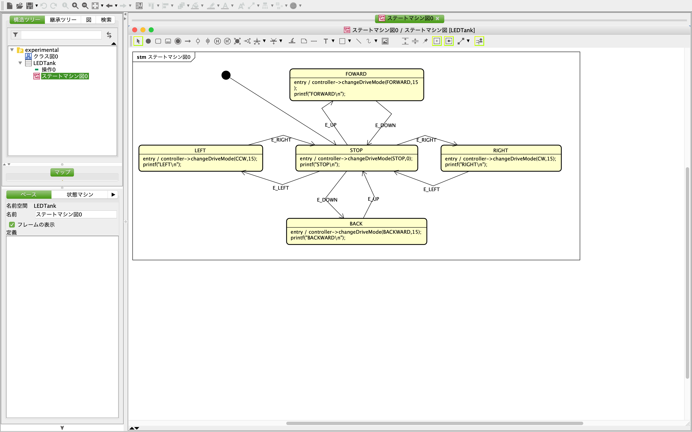
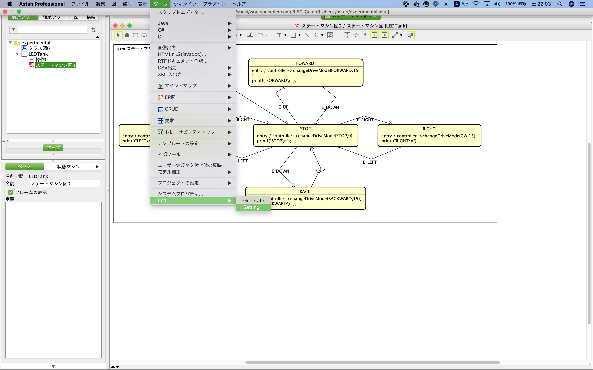
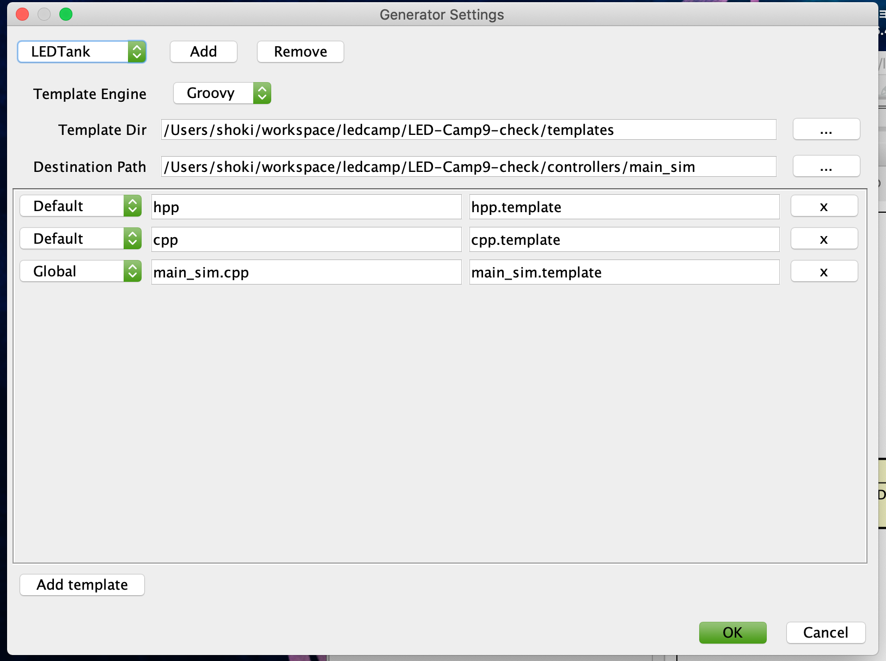
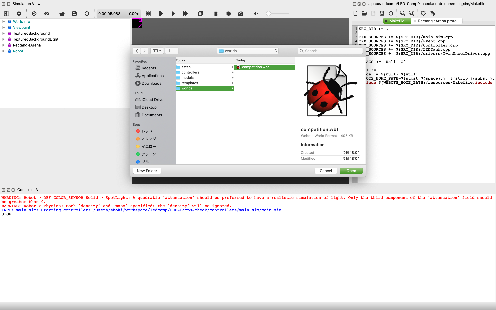
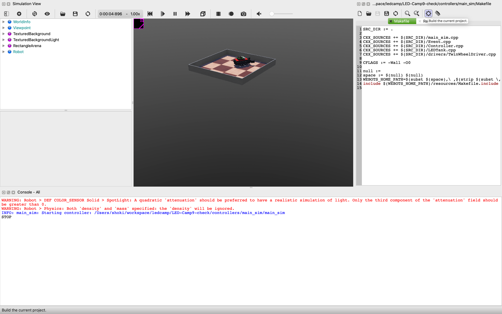

# 動作確認
ここでは確認用のファイル一式をダウンロードし、正しくセットアップが行われたかどうかの確認を行います。以下画面は Mac OS のものを載せていますが基本的にWindowsでも同じです。


##  リポジトリのダウンロード
1. Windowsの方はGit Bash、 Macの方はターミナルを起動して作業用のフォルダを用意します。

```sh
mkdir ~/workspace
cd ~/workspace
```

2. 作業用フォルダに移動したらgithubより、動作確認用のファイル一式を取得します。

```sh
git clone https://github.com/LED-Camp/LED-Camp9-check.git
```

## astah でサンプルモデルからコードを自動生成する
1. astah を起動します
2. ファイル->プロジェクトを開く を選択します。
    <p></p>
3. `astah/experimental.asta`を選択し、プロジェクトを開きます。
    <p></p>
4. 左側の構造ツリーからステートマシン図をダブルクリックし、状態遷移図が表示されることを確認します。
    <p></p>
5. 次に、ツール->m2t->Settingと進み、設定を行います。
   <p></p>
6. Add をクリックし、設定の名前を入力します(画像ではLEDTankと入力しています)。
    <p></p>
6. Template Dir には`templates/`フォルダを選択します。
7. Destination Path には`controllers/main_sim/`フォルダを選択します。
8. Add templateを3回クリックし、以下のように設定します。
    - default / hpp / hpp.template
    - default / cpp / cpp.template
    - Global / main_sim.cpp / main_sim.template
    <p></p>

9. ツール->m2t->Generateをクリックし、コードが自動生成されたことを確認します。
    <p></p>

正常にコード生成が行われない場合は、プラグインの設定を再度ご確認ください。

## Webotsでコードを動かす
1. Webotsを起動します。
2. File->Open Worldより`worlds/competition.wbt`を選択します。
    <p></p>
    <p></p>
3. 右のエディタ
4. 歯車のマークよりコードのビルドを行います。
    <p></p>
5. ビルドが成功したらシミュレーションを実行します(ダイアログが出たらResetをクリックします)。
    <p></p>
    <p></p>
6. 一度3Dグラフィックの画面をクリックし、W/A/S/Dを押すことでロボットが動作することを確認します。

# 最後に
お疲れ様でした。これでLED-Camp当日に必要なセットアップは全て完了となります。