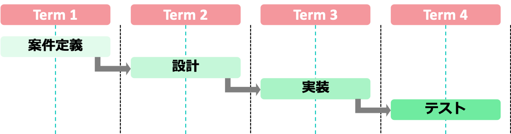

# はじめに
こんにちは。本資料では、「みんなでScrum!」で演習予定のScrumフレームワークについて、基本的な知識をまとめております。ぜひご一読ください。なお、本資料はScrumフレームワークを作り上げたことで有名なジェフ・サザーランドさんのThe Scrum Guide[1]に準じた資料になっています。

## アジャイル開発手法

スクラムを知る前に、アジャイル開発手法について知る必要があります。
ソフトウェア開発をはじめとする開発プロジェクトでは、必ず開発する上でのルール・手順が存在すると思います。アジャイル開発手法とは、近年多くの企業が導入している開発スタイルの1つです。
よくウォーターフォール開発と比較されます。下の図と共に両者の違いを見てみましょう！

</img>
</img>

- [1]	Jeff, Sutherland and Ken, Schwaber,`` The Scrum Guide ’’, http://www.scrumguides.org/docs/scrumguide/v1/Scrum-Guide-JA.pdf - zoom=100, 2013
- [2]	細合晋太郎, ``みんなでScrum!!! ’’, http://swest.toppers.jp/LED-Report/Camp3/flashair/proceedings.html, 2015
- [3]	Kent, Beck and et all , ‘’Manifesto for Agile Software Development’’, http://www.agilemanifesto.org/
