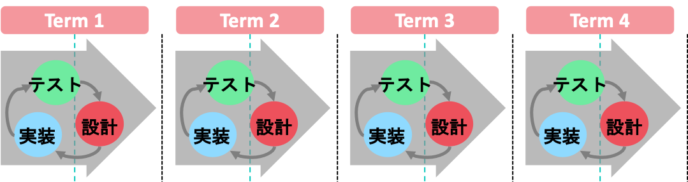

# はじめに
こんにちは。本資料では、「みんなでScrum!」で演習予定のScrumフレームワークについて、基本的な知識をまとめております。ぜひご一読ください。なお、本資料はScrumフレームワークを作り上げたことで有名なジェフ・サザーランドさんのThe Scrum Guide[1]に準じた資料になっています。なお、以下Scrumをスクラムと呼称します。

## アジャイル開発手法

スクラムを知る前に、**アジャイル開発手法**について知る必要があります。
ソフトウェア開発をはじめとする開発プロジェクトでは、多くの場合、開発する上でのルール・手順が存在
しています。アジャイル開発手法とは、近年多くの企業が導入している開発スタイルの1つで、よくウォーターフォール開発と比較されます。下の図と共に両者の違いを見てみましょう。

**ウォータフォール式**

**アジャイル式**

### ウォータフォール開発
**ウォーターフォール開発**とは、大きく分析・設計・実装・テストの4つに分割し、仕様書に則って作っていくものです。各工程は別々の人が行い、前の工程に戻ることは想定されていません。

- **メリット** 
スケジュール管理がしやすく、各工程で文書作成をするため、プロジェクト管理がしやすい・品質が保証できるといった利点が挙げられます。
- **デメリット** 
変化に弱く、仕様変更が難しいです。また、最後まで動いているものが見れず、動いたとしてもすでに時代に乗り遅れているといったケースもあります。近年は変化が特に激しく、携帯電話用に開発していたツールをリリースしようとしたら、世の中はスマホが急速に普及してたから開発が全部ムダになった！なんてこともザラにあるようです。

### アジャイル開発
**アジャイル開発**とは、短い期間(1週間〜1ヶ月)を区切って、その期間中に動作する完成品の一部を作り、それを繰り返すものです。ウォーターフォール開発の各工程をぎゅっと小さくして何回も繰り返すイメージです。
開発ごとにテストをすることによって、「常に動作する」ものを作り続けるという特徴があります。

- **メリット** 
最終的なリリース期間はウォーターフォールと同じですが、時代のニーズに合わせた製品を作ることが可能です。また、柔軟に変化に対応できることから、不具合が発生した際でも、修正の工数が少なく済みます。

- **デメリット** 
開発を進めていく中で，より良い方向性を実現するために改善やテストを繰り返すことで，当初思い描いていた計画の方向性がずれてしまったり、先が読めないものを扱うことが多いため、コストが読めないといった問題点があります。

スクラムは、アジャイル開発手法の一種です。LED-Campではこのアジャイル開発を用いて開発演習をしていきます。次の章からはスクラムについて学んでいきます。スクラムについて理解を深めた上で、当日に活かせるようにしましょう。

## 参考

- [1] Jeff, Sutherland and Ken, Schwaber (2013),「スクラムガイド」, https://www.scrumguides.org/docs/scrumguide/v2017/2017-Scrum-Guide-Japanese.pdf
- [2] 細合晋太郎 (2015), 「みんなでScrum!!!」, http://swest.toppers.jp/LED-Report/Camp3/flashair/proceedings.html
- [3] Ken, Beck and et all , ``Manifesto for Agile Software Development’’, http://www.agilemanifesto.org/
- [4] 平鍋健児・野中郁次郎 (2013), 「アジャイル開発とスクラム~顧客・技術・経営をつなぐ協調的ソフトウェア開発マネジメント」, 翔泳社
- [5] Jonathan Rasmusson著, 西村直人・角谷慎太郎監訳, 近藤修平・角掛拓未訳 (2011), 「アジャイルサムライ」, オーム社
- [6] 西村直人・永瀬美穂・吉羽龍太郎 (2013), 「SCRUM BOOT CAMP THE BOOK」, 翔泳社

[次の章](scrum_overview.md)  
[事前学習トップに戻る](../../index.md)  