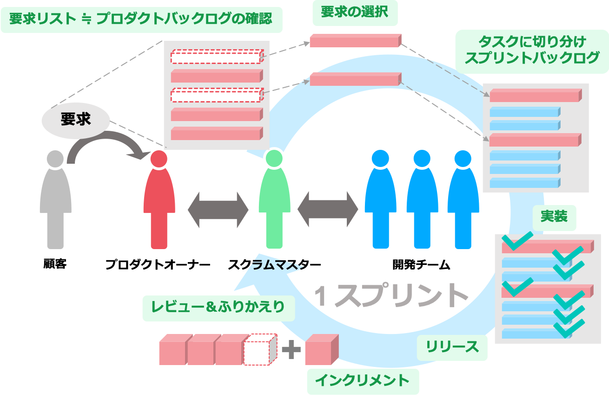
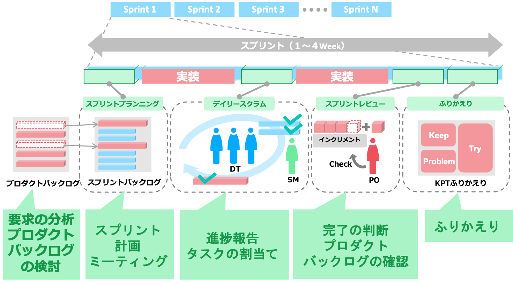

# スクラムとは

## スクラムの概要

近年は、世の中のお客さんのニーズが流動的に変化し、それに伴い、技術進化も非常に活発に行われています。そうした中で、常に進む方向を調整しながら目的を達成できるプロダクトを作るために、効率的なチーム開発をチームが一丸となって行う作業・会議・成果物を定めたものです。
スクラムには以下のような特徴があります。

- 成果の最大化を目的とする
  - 要求に優先順位をつけることによって、成果を最大にする
- 時間の枠を決めて進める(タイムボックス)
  - 固定の時間に区切って作業をすすめる
- 進捗の見える化(透過性)
  - 目標や現在の状況、問題点を見える化する
- レビュー(検査)
  - 作成物や進捗、開発に問題がないか定期的に確認する
- ふりかえり(適応)
  - 進捗の遅れややり方に問題があった際は調整・改善する

## スクラムの役割
スクラムを回す上でできたチームのことを、スクラムチームと言います。
その中で決められている役割は以下の3種類です。

### プロダクトオーナー
プロダクトの価値を最大化することに責任を持つ人です。
顧客から要求を聞き出し、このプロジェクトで何を作りたいかを考え、チーム内で共有します。いわゆる営業職のような役割です。すなわち、顧客要求を正確に分析し、技術課題に落とし込むことが求められます。

### 開発チーム
実際に開発を担当する人たちであり、常にリリース可能な機能を完成させることに責任を持ちます。プロダクトオーナーが実現したいプロダクト、それに必要な要素技術を実装します。コードを書くだけでなく、要求の聞き出し・見積もり・設計・デザイン等、必要な作業を全部こなします。人数は3人〜9人と、少人数で行います。

### スクラムマスター
スクラムを問題なく進められるようにリードする人です。作業を円滑に進められるようにする、サポーター的な役割を持っています。もしうまく行かないことがあって、スクラムがうまく進んでいないときはその問題を取り除いていきます。

## スクラムの流れ

スクラムでは、スプリントという短い期間を繰り返します。一般的に、1スプリントは1週間〜1ヶ月とされており、一度期間(タイムボックス)を決めた場合、適切な進捗管理とその評価をするために、期間の延長・短縮はしません。

以下、上図の左から内容を説明します。

### プロダクトバックログの作成
プロダクトオーナーが顧客要求を分析し、実現すべき機能をリスト化します。この「要求リスト」を**プロダクトバックログ**といいます。この要求リストの項目が全部完了した際に、開発の完了と定義します。
次に、重要度や優先度に応じて開発の順序を決定していきます。

### スプリントバックログの作成
プロダクトバックログを開発全体の進捗、やるべきリストと捉え、次に各スプリントで何を開発するかを決めていきます。
ここで、1スプリント内に、プロダクトバックログから当該スプリントで何を開発するか選択します。更にその項目をより詳細にタスク分けを行います。この工程で発生したタスクリストを**スプリントバックログ**と呼びます。スプリントバックログは、プロダクトバックログの項目を達成するためのもの、と考えてください。この際、スプリントバックログで作成されるタスクは、適切に開発進捗を管理するため、必ず「何を持って完了とするか」を明確に定義しておく必要があります。

### 実装
実際の開発期間です。

### レビューとふりかえり
スプリントの最後に、スプリントバックログにあげたタスクの進捗状況や開発物の動作確認、プロダクトバックログの
再確認など、レビュー(スプリントレビュー)を行います。この際。各スプリントにおいて完成してきたプロダクトバックログアイテムのまとまりを**インクリメント**と呼びます。インクリメントは常に利用可能であり、動作するのが理想です。レビューを終了した後にふりかえりを行い、次のスプリントを円滑に進めるための計画と改善案を話し合います。

これらを繰り返すことによって、開発を進めていきます。具体的な手順は次の章で説明します。

**用語まとめ**
- スプリント
  - 開発期間の１単位。１週間〜1ヶ月など比較的短期間で設定する
- プロダクトバックログ
  - いわゆる要求リスト
- スプリントバックログ
  - プロダクトバックログをより具体的にタスクに分割したリスト
- インクリメント
  - 開発物。成果物

**スクラムで登場する役割**
- プロダクトオーナー
  - 開発するプロダクトの責任を持つ人。
- スクラムマスター
  - スクラム全体のサポートを行う人。
- 開発チーム
  - 実際に開発を行う人。

[前の章](scrum_intro.md)  
[次の章](scrum_howto.md)  
[事前学習トップに戻る](../../index.md)  